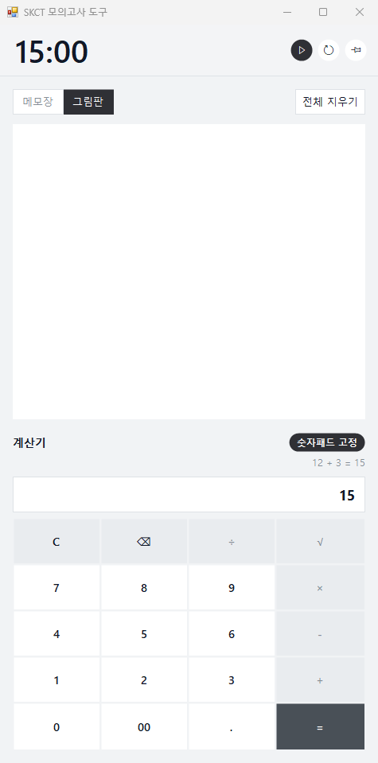

# SKCT 모의고사 도구 (SKCTAddon)

SKCT 온라인 모의고사를 풀 때 화면 오른쪽에 띄워 두는 보조 창입니다.
모의고사를 풀면서 그림판, 계산기, 시계 앱을 따로 띄워 두니 창을 오가기가 불편했습니다. 그래서 세 가지를 창 하나로 합쳤고 계산기는 시험용 계산기와 같은 버튼 배치로 연습할 수 있게 만들었습니다.



## 기능

### 타이머
- **15분 역산** 타이머입니다. `15:00`에서 시작해 0까지 셉니다.
- 0이 되면 자동으로 멈추고, 시간이 끝난 것을 바로 알 수 있게 타이머 줄이 빨간색으로 바뀝니다. 이 상태에서 ▶를 누르면 15:00부터 다시 시작합니다.
- ↺를 누르면 15:00으로 돌아갑니다. 돌아가던 중이었다면 바로 이어서 세고, 멈춰 있었다면 15:00에서 기다립니다.
- 📌을 켜면 창이 항상 위에 표시됩니다.

### 메모장 / 그림판
- **메모장 | 그림판** 버튼으로 전환합니다. 전환해도 양쪽 내용은 각각 남습니다.
- **전체 지우기**를 누르면 지금 보이는 쪽만 확인 창 없이 바로 비웁니다.
- 그림판 펜은 검은색 한 가지이고 두께도 하나로 고정했습니다.

### 계산기
- 버튼 배치: `C ⌫ ÷ √` / `7 8 9 ×` / `4 5 6 -` / `1 2 3 +` / `0 00 . =`
- 누른 순서대로 계산합니다(일반 계산기 방식). 그래서 `2 + 3 × 4 =`는 20입니다.
- 유효숫자 16자리까지 표시하고 큰 수를 읽기 쉽게 1,234,567처럼 세 자리마다 쉼표를 찍습니다.
- 결과 칸 위에는 마지막 계산식(예: `78 + 2 = 80`)이 나옵니다.

### 숫자패드 고정
- 켜 두면 **다른 창(크롬 등)을 보고 있어도 숫자패드 입력이 이 계산기로** 들어갑니다. 그래서 문제를 보면서 계산기를 클릭할 필요가 없습니다.
- 숫자패드의 `0~9 + - * / .`와 숫자패드 `Enter`(=), 그리고 `Backspace`(한 글자 지우기)와 `Esc`(C)만 가로챕니다. 일반 숫자열이나 메인 Enter 같은 다른 키는 원래 창으로 그대로 갑니다.
- 켜 두는 동안은 `Backspace`와 `Esc`도 계산기로 가기 때문에 다른 창에서 글자를 지우거나 Esc로 전체화면을 빠져나올 수 없습니다. 이럴 때는 잠깐 끄고 씁니다.
- 이 창을 보고 있을 때는 가로채지 않습니다. 그래서 이 창의 메모장에 타이핑하면 숫자패드, Backspace, Esc가 모두 메모장으로 들어갑니다.
- 창을 최소화하면 가로채지 않습니다. `Alt`나 `Ctrl`을 누른 채 친 입력(Alt 코드 등)도 그대로 통과합니다.
- NumLock이 켜져 있어야 동작합니다.
- "계산기" 제목 오른쪽의 **숫자패드 고정** 버튼으로 켜고 끕니다. 버튼이 어두운 색이면 켜진 상태입니다. 다른 창의 Backspace와 Esc까지 가져가는 기능이라 처음에는 꺼져 있고, 한 번 켜면 다음 실행에도 켜진 채로 시작합니다.

## 키보드

이 창이 활성 상태이고 메모장에 타이핑하는 중이 아니면, 아래 키가 계산기로 들어갑니다.

| 키 | 동작 |
|---|---|
| 숫자, `.` | 숫자 입력 |
| `+` `-` `*` `/` | 연산 |
| `Enter`, `=` | 계산 |
| `Backspace` | 한 글자 지우기 |
| `Esc` | C (전체 초기화) |

메모장에 쓰다가도 계산기 버튼을 한 번 누르면 키보드 입력이 계산기로 넘어옵니다.

## 실행과 빌드

윈도우에 기본으로 들어 있는 .NET Framework 4로 만들어서 따로 설치할 것이 없습니다.

[Releases](https://github.com/easyhunjune/SKCTAddon/releases/latest)에서 `SKCTAddon.exe`를 받아 바로 실행하면 됩니다. 서명하지 않은 exe라서 "Windows의 PC 보호" 창이 뜨면 **추가 정보 → 실행**을 누릅니다.

직접 빌드해서 쓰려면 다음 순서를 따릅니다.

1. `build.bat`를 실행하면 같은 폴더에 `SKCTAddon.exe`가 생깁니다.
2. `SKCTAddon.exe`를 실행합니다.

직접 빌드하려면 다음 명령을 씁니다.

```bat
%WINDIR%\Microsoft.NET\Framework64\v4.0.30319\csc.exe /nologo /target:winexe /codepage:65001 /r:System.Windows.Forms.dll /r:System.Drawing.dll /out:SKCTAddon.exe SKCTAddon.cs
```

## 설정 저장

다음에 켤 때 같은 상태로 열리도록 아래 설정을 `%LOCALAPPDATA%\SKCTAddon\settings.txt`에 저장합니다.

- 창 위치와 크기
- 메모장과 계산기 사이 경계
- 📌 상태
- 마지막으로 연 탭
- 숫자패드 고정 여부

이 파일을 지우면 처음 상태(화면 오른쪽, 세로 가운데)로 돌아갑니다.

## 고치기 쉬운 곳 (`SKCTAddon.cs`)

| 바꿀 것 | 위치 |
|---|---|
| 역산 시간 | `MainForm.CountdownMinutes` |
| 펜 색과 두께 | `Canvas.PenColor`, `Canvas.BasePenWidth` |
| 계산기 버튼 배치 | `CalcPanel.Labels`, `CalcPanel.Keys_` |
| 색상 | `Theme` |

## 일부러 넣지 않은 것

뒤로가기, 지우개, 저장, 확인 창은 넣지 않았습니다. 모의고사를 푸는 동안 쓰는 기능만 남겼습니다.

## 참고

- 숫자패드 고정은 윈도우 전체의 키 입력을 먼저 받아 보는 저수준 키보드 훅(`WH_KEYBOARD_LL`)으로 만들었습니다. 이 훅으로 숫자패드 키와 Backspace, Esc만 확인하고 입력 내용은 어디에도 기록하지 않습니다. 다만 서명 없는 exe가 키보드 훅을 쓰면 일부 백신이 경고할 수 있습니다.
- 누른 순서대로 계산하는 방식이 실제 SKCT 계산기와 같은지는 확인하지 못했습니다.
